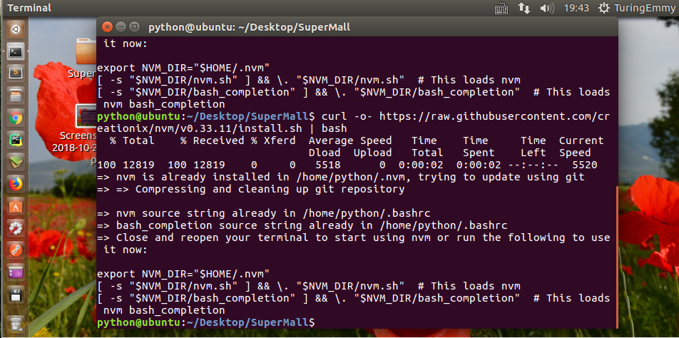
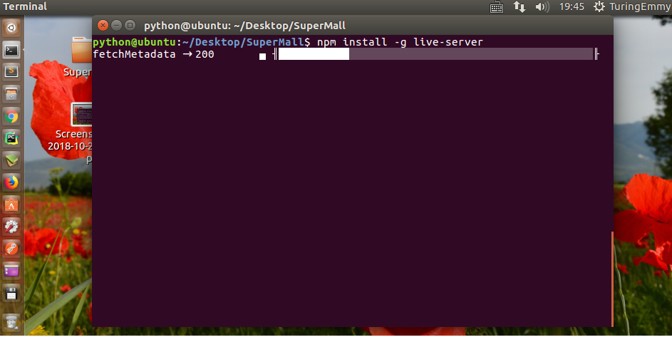
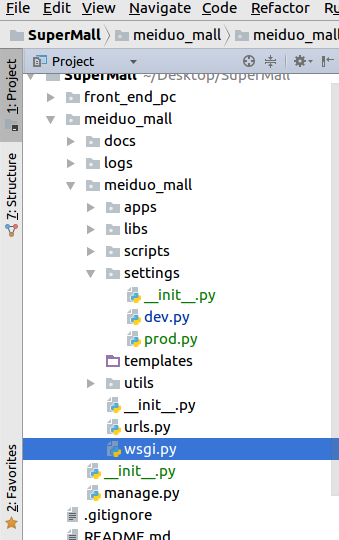

### 一、创建远程仓库，添加前端页面

在GitHub上创建仓库`https://github.com/TuringEmmy/SuperMall.git`

在本地设置静态文件的目录，并推送至云端`git push origin master:master`


### 二、live-server提供静态文件

可以使用前端node.js 提供的服务器live-server作为前端开发服务器使用。

安装node.js的版本控制工具nvm，在终端中执行

```python
curl -o- https://raw.githubusercontent.com/creationix/nvm/v0.33.11/install.sh | bash
```

**重新进入终端**，使用nvm安装最新版本的node.js

```python
nvm install node
```



安装live-server

```
npm install -g live-server
```



使用

```
# 在静态文件目录front_end_pc下执行
live-server

```

live-server运行在8080端口下，可以通过`127.0.0.1:8080`来访问静态页面。

### 三、后端项目创建目录调整



修改manage.py，使用settings中的dev配置

```
os.environ.setdefault("DJANGO_SETTINGS_MODULE", "meiduo_mall.settings.dev")
```

这个主要是路径的寻找问题

### 四、子应用的创建和注册

在setting上中

```python
# sys.path: 项目运行时搜索包目录列表
sys.path.insert(0, os.path.join(BASE_DIR, 'apps'))
```

创建app的时候还是要注意路径的问题,进入任何文件夹下都可以创建，只要文件的路径正确，按照apps下的为例

```
python ../../manage.py startapp users
```

因为在setting里进行的提前设置，目标检索会自动搜索路径，所以和平时的app安装一样
